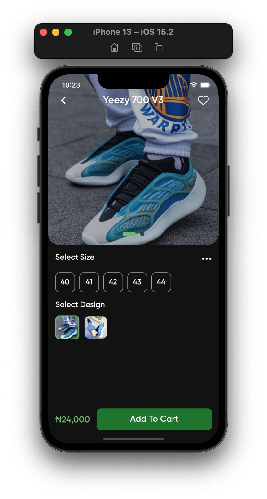

# Kicks Citi
### An online footwear store

## Features
- Add items to your cart or favorites
- Browse a selection of products
- Complete order payments
- Track the status of your orders within the app.
- Speak to support personnel 
## Technologies Used
- React Native
- Firebase
- Flutterwave for handling payments
- Cloud Functions
- Redux
- Axios
- Sirv - Image Hosting

## How To Install
You can get the app on [play store](https://play.google.com/store/apps/details?id=com.my.ben.kicksciti)

