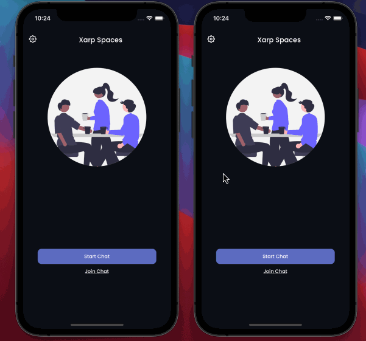

# Xarp Spaces
### Securely chat and share unlimited files serverlessly with WebRTC peer-to-peer technology, available now on the app store.

 
 

### Set your username to start a chat

### Server less chat

### Video & Voice Calls

## Description
Introducing Xarp Spaces, your ultimate peer-to-peer chat and file sharing solution, revolutionizing secure direct connections without relying on servers!

With Xarp Spaces, chat effortlessly with loved ones, send files of any size limitlessly, and indulge in crystal-clear video and voice calls.

Say goodbye to server-related worries, prying eyes, or file size constraints. Utilizing cutting-edge peer-to-peer technology ensures lightning-fast and rock-solid connections. Plus, end-to-end encryption guarantees unwavering security for your conversations and files.

Don't wait any longer – download the app today and embark on a new era of secure and seamless communication!

## How To Install
Android Users: Get on [Play Store](https://play.google.com/store/apps/details?id=com.xarpspaces.android)
 
iOS Users: Get the app on [App Store](https://apps.apple.com/app/xarp-spaces/id6444863755)

## Features
- WebRTC peer-to-peer technology for real-time communication
- Private, secure messaging with end-to-end encryption
- Unlimited file sharing
- Voice and video calls
- Cross-platform compatibility
- Instant messaging
- Transfer images and videos for easily
- Simple, user-friendly interface
- Secure, encrypted file transfer

## Technologies Used
- React Native
- Firebase
- WebRTC

> As the project sole fullstack developer, I was responsible for the entire development process and the design of the user interface.
