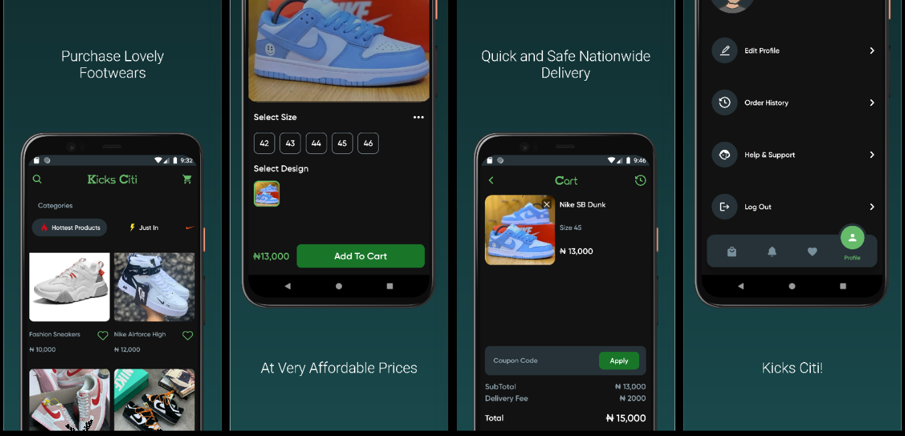

# Kicks Citi
### An E-Commerce store for Shoe Enthusiasts.
> I was the app's sole fullstack developer
> I also designed the UI myself

Kicks Citi is designed to be a one-stop destination for individuals who are passionate about footwear. Whether you're a sneakerhead, a fashion-forward trendsetter, or someone simply in need of comfortable and stylish shoes, Kicks Citi has got you covered

## Features
- Add items to your cart or favorites
- Browse a selection of products
- Complete order payments
- Track the status of your orders within the app.
- Speak to support personnel 
## Technologies Used
- React Native
- Firebase
- Flutterwave for handling payments
- Cloud Functions
- Redux
- Axios
- Sirv - Image Hosting

## How To Install
You can get the app [here](https://play.google.com/store/apps/details?id=com.kicksciti.android)
 
 
[Github Repo](
https://github.com/benjamineruvieru/kicksciti)

