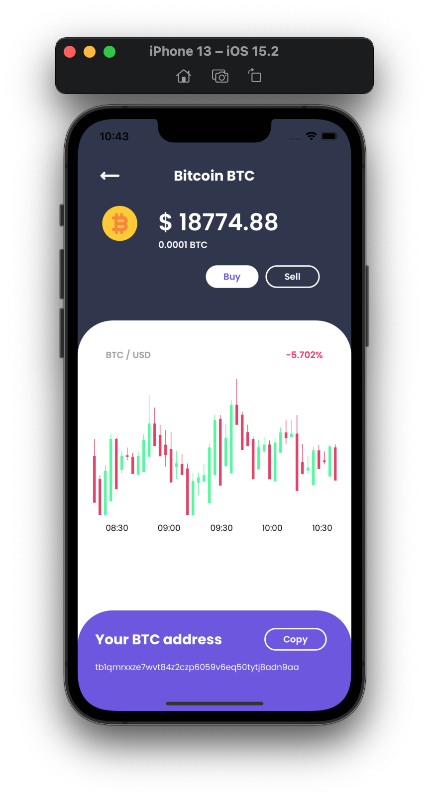
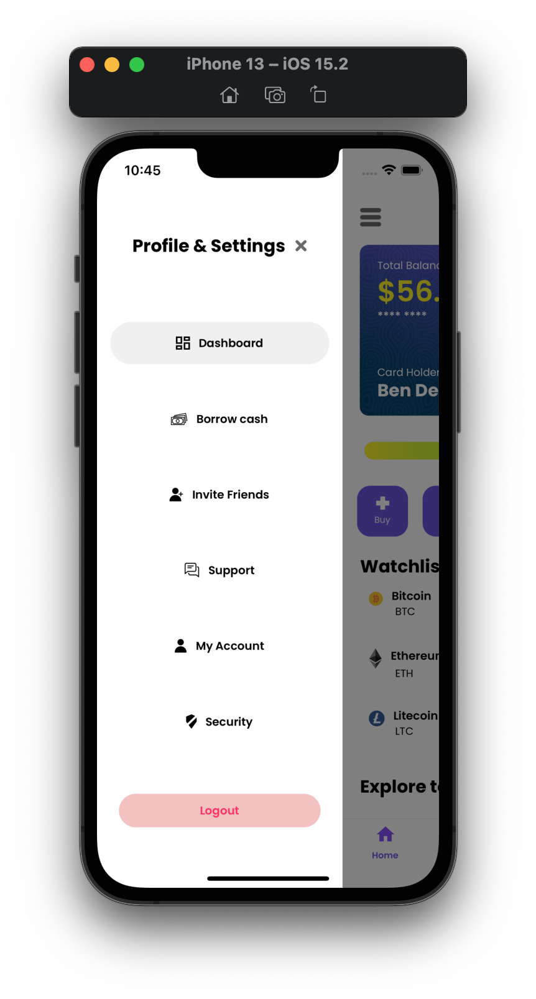
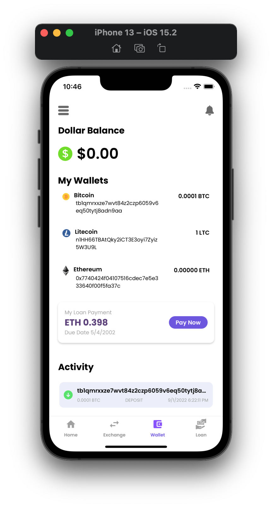
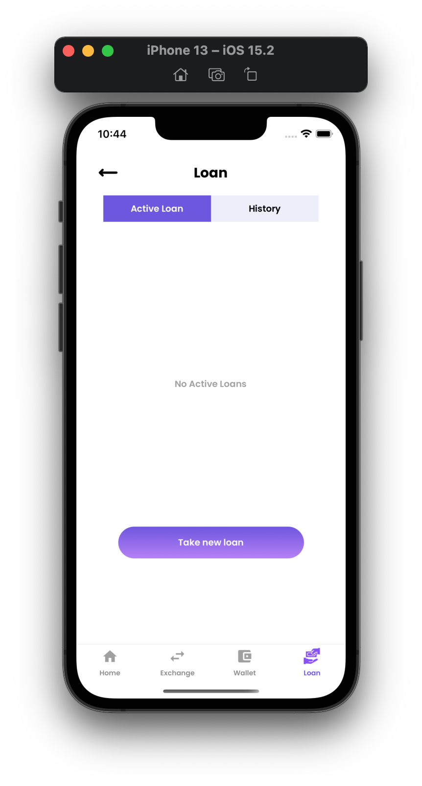
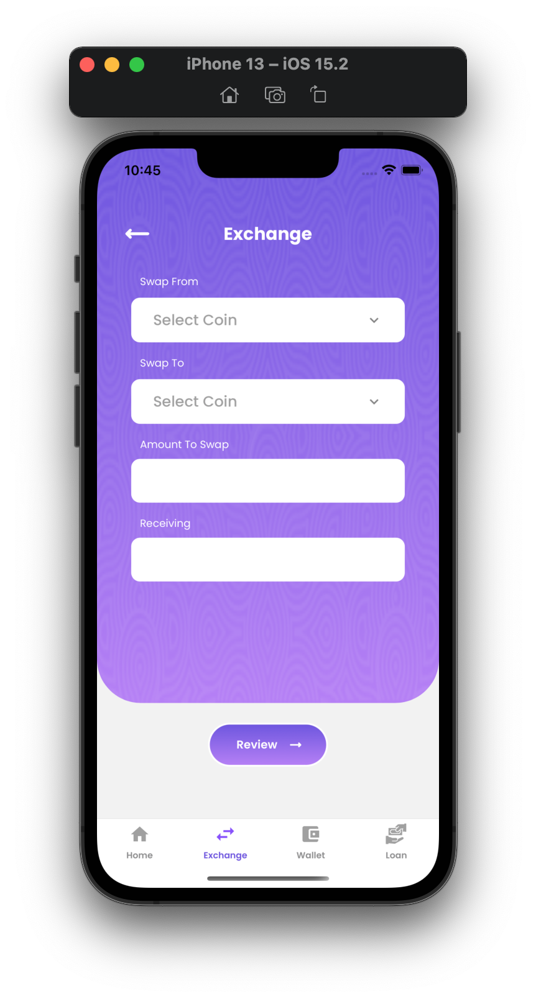
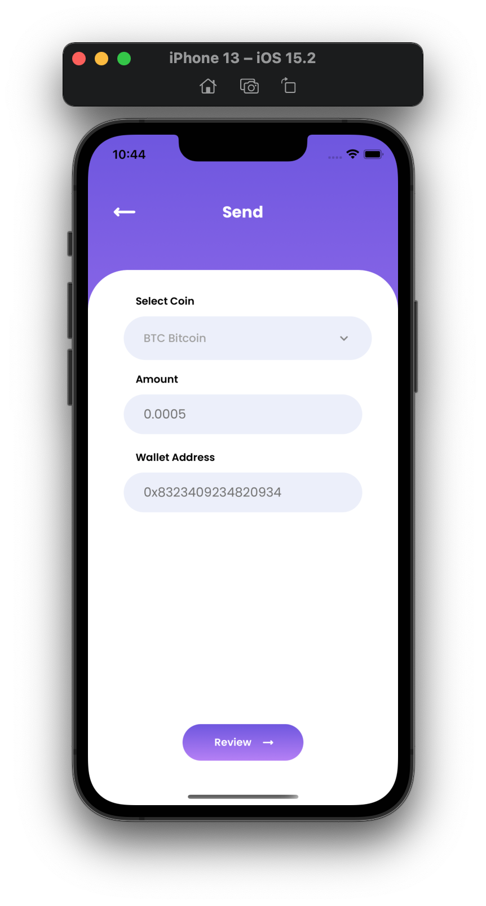
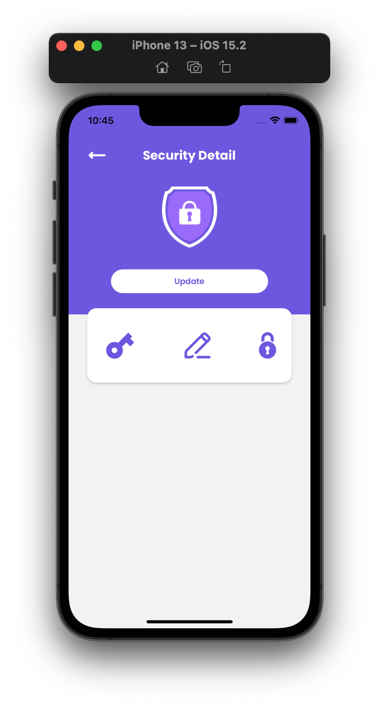

# Ledger Score
### A crypto loan app, that tracks crypto currency prices in real time and offers crypto wallets

> I was the app's sole full-stack developer.
> An UI/UX designer designed the screens it.
## Features
- Collect loans in crypto currencies
- Track real time crypto currency prices 
- Send and Receive crypto currencies
- Exchange crypto currencies

## Technologies Used
- React Native
- Firebase Auth | Firestore | Cloud Functions
- Node Js
- Binance Apis

## How To Install
This app was built for a client and is not live yet, although already completed.
 
 
Github Repo[Private]

