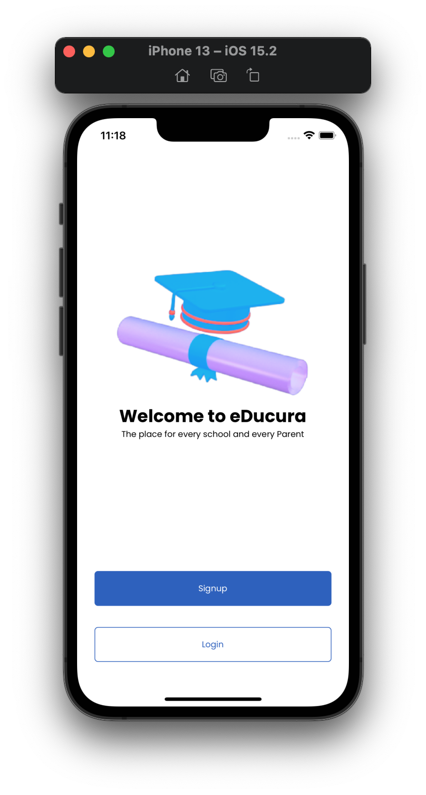
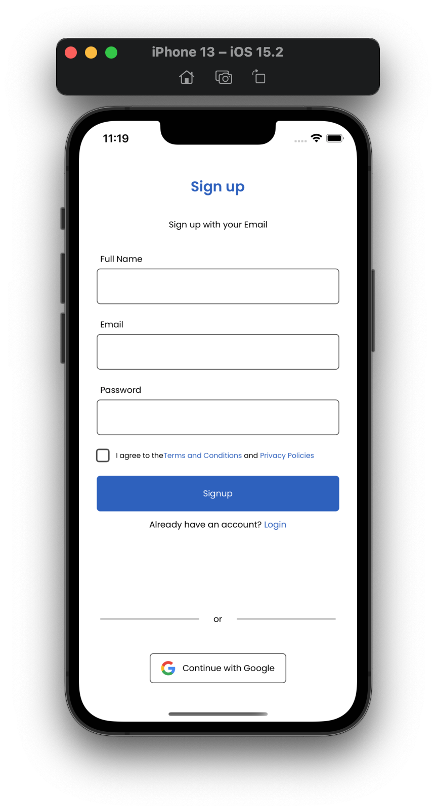
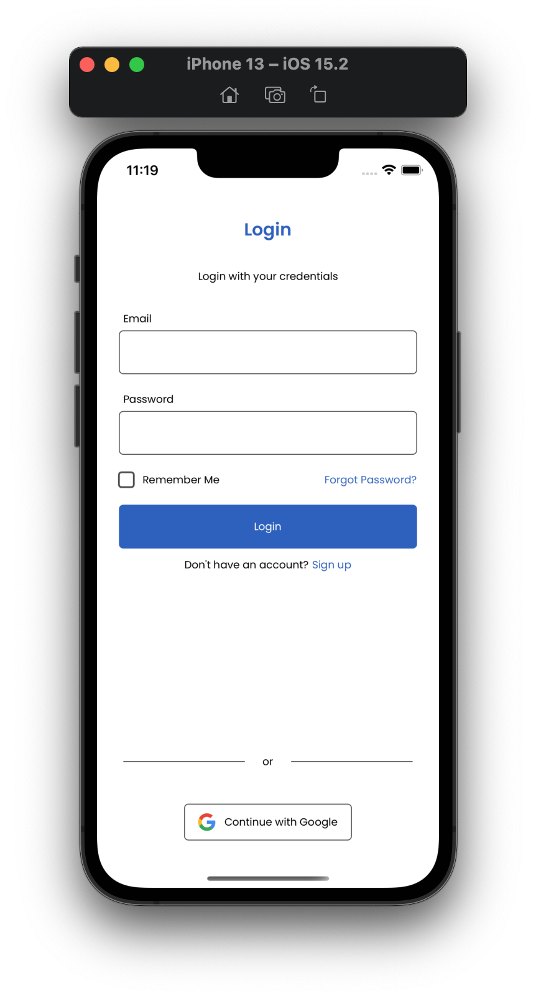
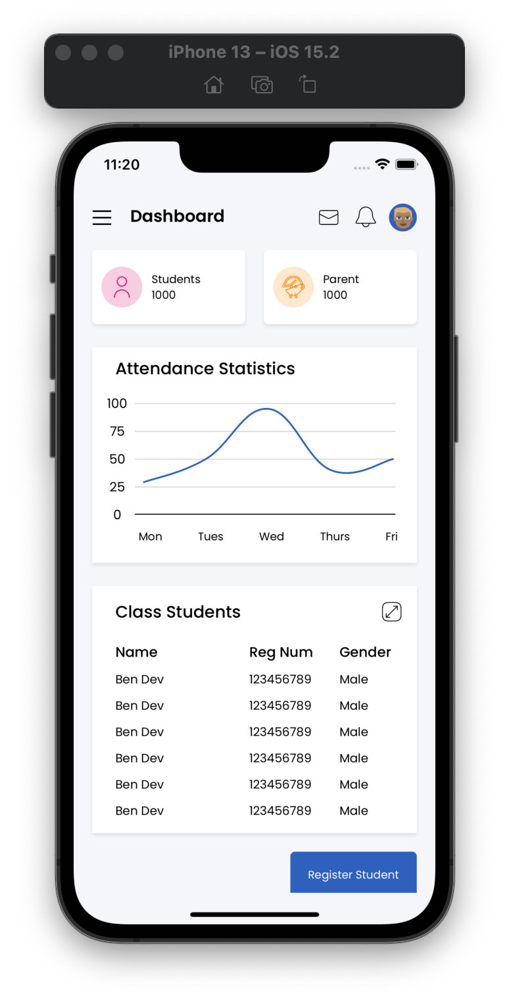
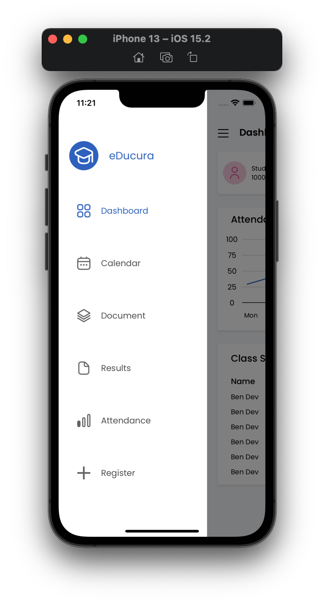
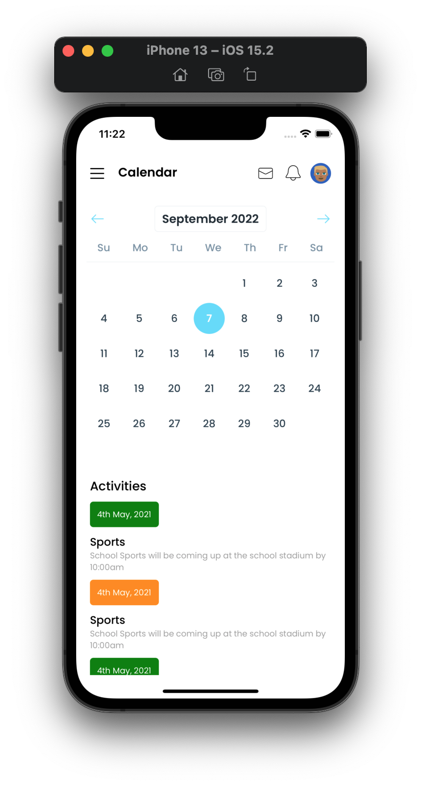
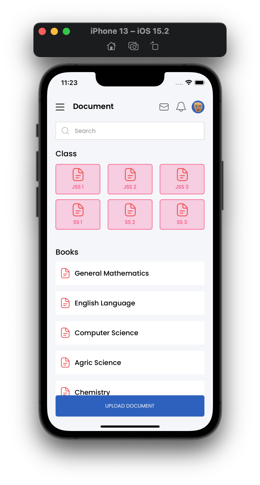
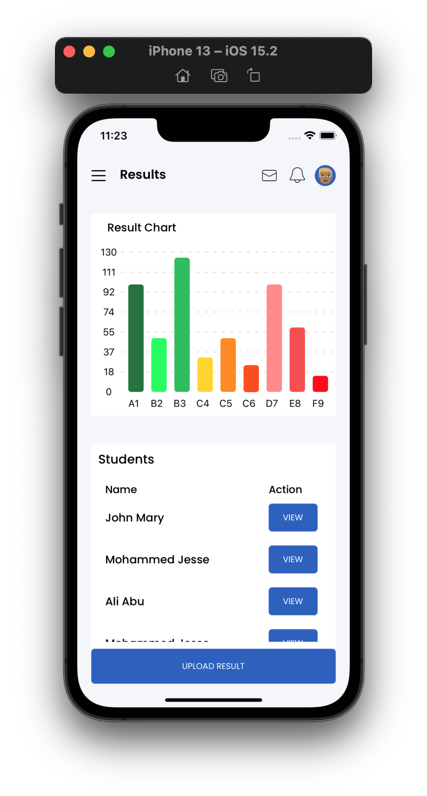
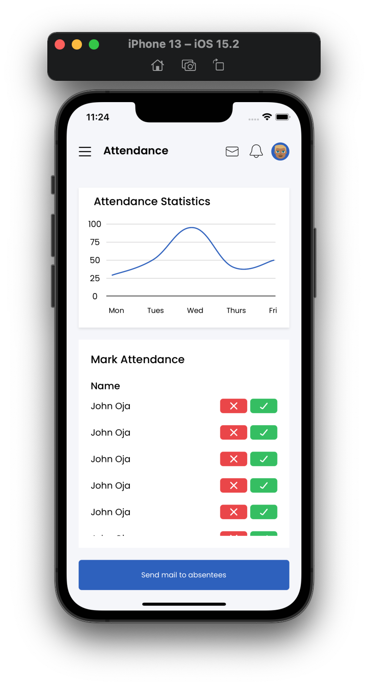

# Educura
### This app links parents and teachers while assisting teachers and admins organize their work.

## Features

## Technologies Used

## How To Install
This app was built for a client and is not live yet.
 
 
Github Repo[Private]

