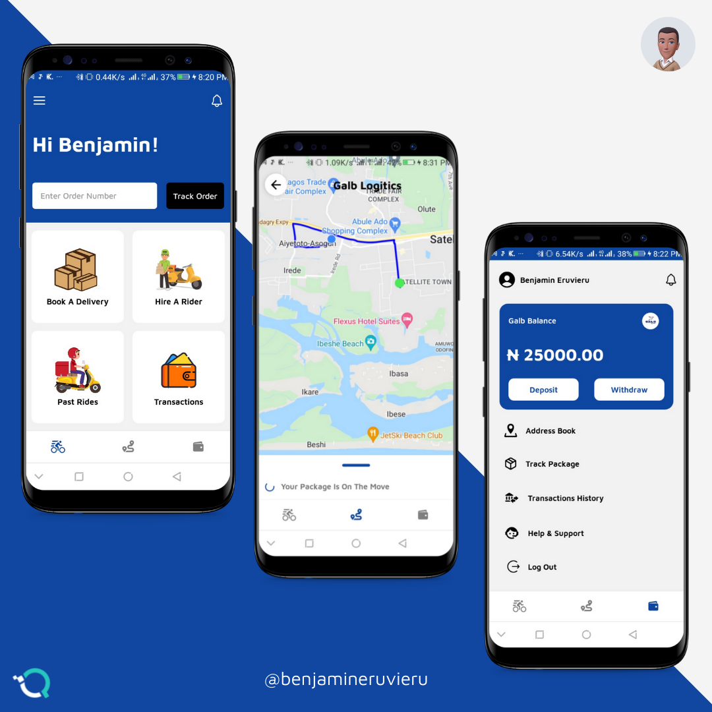

# Galb Logistics
### A mobile application for a goods delivery service including product tracking
> I was the app's sole fullstack developer.
> I also designed the UI myself

## Features
- Pickup and Delivery Services
- Order Tracking
- Deposits and Withdrawals
- Live Chat to handle issues

## Technologies Used
- React Native
- Firebase
- Flutterwave for handling payments
- Google Maps
## How To Install
This is a personal side project and is not live yet
 
 
[Github Repo](
https://github.com/QICSoftwares/Galb-Logistics)

