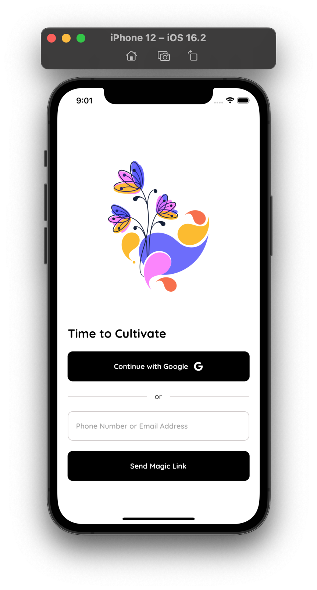
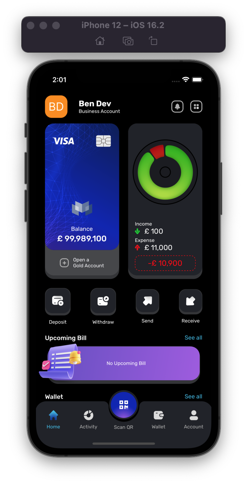
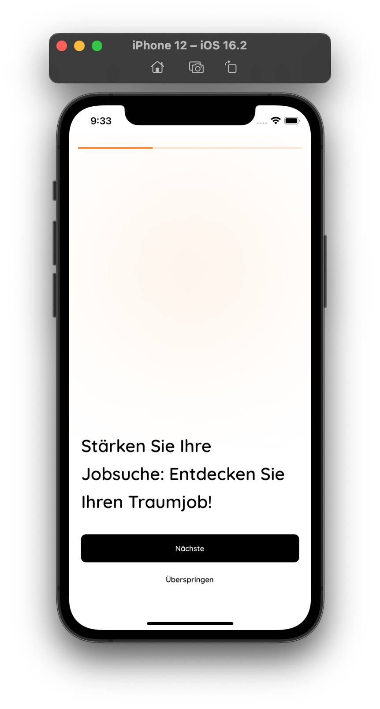
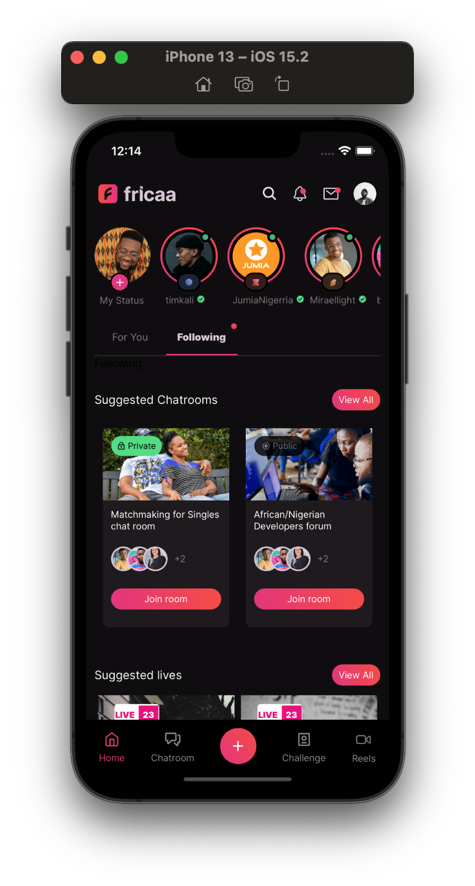
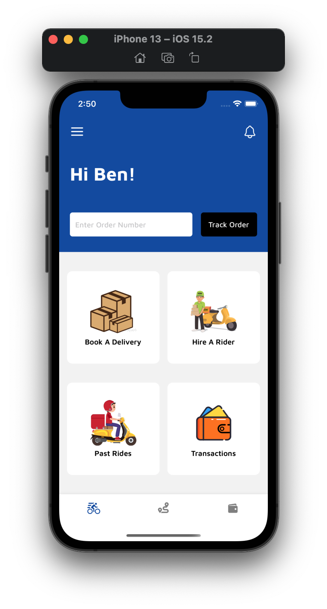
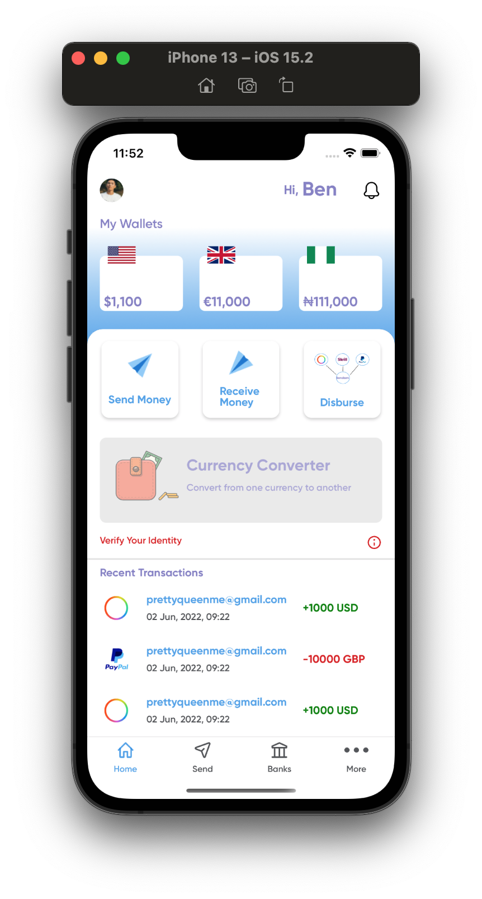

# **Welcome to My Project Compilation**
This repository comprises a diverse range of projects I have worked on, some of which are still under development while others have been completed.

 

It is organized into two main sections:
1. **Personal Projects**: This section showcases my personal projects that are currently in production.
2. **Client Projects Showcase**: Here, you will find a collection of projects I have worked on for various clients. These projects may be either in production or in the development phase.

 

Please feel free to explore and enjoy the compilation of my work.

## **Personal Projects**

<b><u><a href="https://github.com/benjamineruvieru/All-Projects-Compilation/tree/main/1.%20Xarp%20Spaces">Xarp Spaces</a></u></b>

 

<b><u><a href="https://github.com/benjamineruvieru/All-Projects-Compilation/tree/main/2.%20Kicks%20Citi%20Mobile%20App">Kicks Citi</a></u></b>

  

<b><u><a href="https://github.com/benjamineruvieru/All-Projects-Compilation/tree/main/13.%20ChitChat">Chit Chat</a></u></b>

  

## Projects Showcase

  

  
<b><u>Nvestos</u></b>

  

  

  
<b><u>Petal Resuce</u></b>

  

  

  
<b><u>Morizon</u></b>

  

  

  
<b><u>NYXEX Swap</u></b>

  

  
<b><u>Ledger Score</u></b>

  

  

  

  
<b><u>Lancio Carriera</u></b>

  

  
  

  
<b><u>Educura</u></b>

  

  
  

  
<b><u>Fricaa</u></b>

  

  
  
  

  
<b><u>Galb Logistics</u></b>

  

  
  
  

  
<b><u>Gigmoni</u></b>

  

## Projects Directories
Directories | Description
----------- | -----------
[1. Xarp Spaces](https://github.com/benjamineruvieru/All-Projects-Compilation/tree/main/1.%20Xarp%20Spaces) | Chat, share files, & video call server-lessly with top-notch security.
[2. Kicks Citi](https://github.com/benjamineruvieru/All-Projects-Compilation/tree/main/2.%20Kicks%20Citi%20Mobile%20App) | An ecommerce sneakers store app
[3. Morizon](https://github.com/benjamineruvieru/All-Projects-Compilation/tree/main/3.%20Morizon) | Experience seamless control over your cryptocurrency portfolio, with features including multi-wallet management, salary payments, payment requests, buying and selling options, card payment integration, bank transfers, escrow services, joint accounts, and more.
[4. NYXEX Swap](https://github.com/benjamineruvieru/All-Projects-Compilation/tree/main/4.%20NYXEX%20Swap) | Effortlessly access and navigate multiple crypto exchanges, profit from automated liquidity pools, and stay on top of the market with real-time coin swapping and dynamic charts.
[5. Ledger Score](https://github.com/benjamineruvieru/All-Projects-Compilation/tree/main/5.%20Ledger%20Score%20Loan%20App) | A crypto loan app, with crypto wallets and real time coin price tracking
<b>6. Fricaa </b>| A social media platform with real time messaging, video sharing and live streaming
[7. Educura](https://github.com/benjamineruvieru/All-Projects-Compilation/tree/main/7.%20Educura%20Mobile%20App) | This app helps teachers organise their work and connects parents to teachers
[8. Galb Logistics](https://github.com/benjamineruvieru/All-Projects-Compilation/tree/main/8.%20Galb%20Logistics%20Mobile%20App) | A product delivery company mobile app with product tracking
[9. Gigmoni](https://github.com/benjamineruvieru/All-Projects-Compilation/tree/main/9.%20Gigmoni%20Mobile%20App) | An international payment solution
[10. Nvestos](https://github.com/benjamineruvieru/All-Projects-Compilation/tree/main/10.%20Nvestos) | 
[11. Lancio Carriera](https://github.com/benjamineruvieru/All-Projects-Compilation/tree/main/11.%20Lancio%20Carriera) |
[12. Petal Rescue](https://github.com/benjamineruvieru/All-Projects-Compilation/tree/main/12.%20Petal%20Rescue) |
[13. ChitChat](https://github.com/benjamineruvieru/All-Projects-Compilation/tree/main/13.%20ChitChat) |

